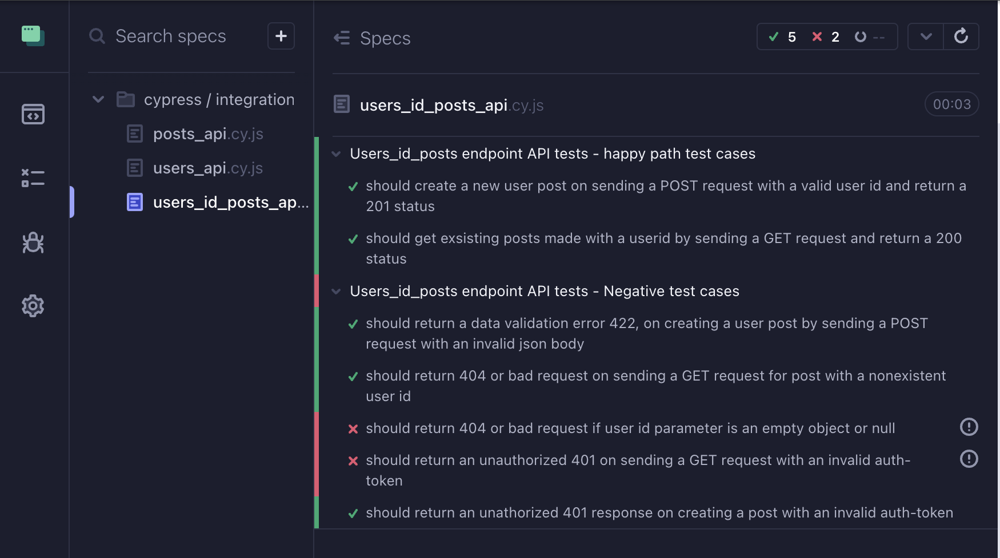
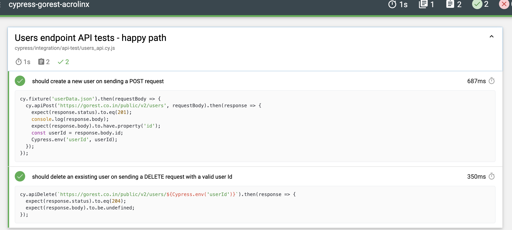

# cypress-gorest-acrolinx
The tests written in this project explores testing the /post, /user and /user/id/posts endpoints available at [gorest](https://gorest.co.in/). Automated tests were written in Javascript with cypress technology

## Getting Started
To run this tests [Node.js](https://nodejs.org/en/) has to be installed on your machine. (Refer to the [.node-version](./.node-version) file for the exact version.). [Cypress](https://docs.cypress.io/guides/getting-started/installing-cypress) for running the test and [cypress-mochawesome-reporter](https://www.npmjs.com/package/cypress-mochawesome-reporter) for collecting and visualizing test results needs to be installed in the project as dependencies

## Installation
To clone this repository locally and install its dependencies, execute the following commands:

```shell
git clone https://github.com/chikaogumka/cypress-gorest-acrolinx
cd cypress-gorest-acrolinx
npm install
```
## Setup environment variables
To call the endpoints for this tests you need to set authentication using an environment file. To do this:
- create a file named `cypress.env.json`.
- To use this file go to [gorest](https://gorest.co.in/consumer/login) site login, generate an access-token
- Use a random user id number from gorest website e.g: `6940567` as userId variable
- Fill in the access-token and userId in the json file that should look like this:
```shell
{
  "access-token": "<access-token>",
  "userId": "<userId>"
}
```

## Run Tests
To run tests, use the following commands outlined in the package.json, run these at the root of the project.

| Endpoints     | commands                                 |
| --------- | ---------------------------------------- |
| All endpoints       | npm run test |
| All endpoints in headless mode        | npm run test:headless   |
| /user/{id}/posts | npm run test:user:id:post:api         |
| /posts     |    test:post:api    |
| /users     | test:user:api |

- Steps to run test in headed mode
  - After running script `npm run test`, select `e2e testing` in the browser console, select chrome and click `run e2e tests`. A window will open with all available tests listed as names of the endpoints. To run a specific endpoint test click on any folder.

## Test results visualization
To visualize the test result there are 2 posibilities:
1. Using Cypress console: View the result in cypress console after running the tests in headed mode. to do this script, `npm run test`. A browser window will open with a breakdown of all the rest result

 

2. Using cypress-awesomeware-reporter: After runing the test, a reports folder will be generated at the root of your project locate a file named `index.html`, locate the file on your local maching and load it in a browser. All results of the tests run will be visible on a webpage.

  

## Testing Strategy and Plan for Gorest endpoints
The following endpoints were tested:
- User endpoint `/users`
- Posts endpoint `/posts`
- Post with user Id `/users/{id}/posts`

## Testing Setup
- Import testing libriaries
- Setup configurations and authentication
- Test functions of endpoints
- Collect/report test results and findings

## Test Plan
The test suite was grouped into 2 main categories: Happy path cases and Negative/Edge cases.

### Happy Path Cases
- `/posts` endpoint
  - should create a new post on sending a POST request with valid body and return a 201 status
  - should create a new post and set id as a variable for DELETE request and return 201 status
  - should delete an exsisting post on sending a DELETE request with a valid post Id and return a 204 status
  - should get exsisting posts on sending a GET request and return a 200 status
  - Response body Schema validation within each request

- `/users` endpoint
  - should create a new user on sending a POST request and return a 201 status
  - should create a new user and set userId as a variable for DELETE request
  - should delete an exsisting user on sending a DELETE request with a valid user Id and return a 204 status
  - should get exsisting users on sending a GET request and return a 200 status
  - Response body Schema validation within each request

- `users_id_posts` endpoint
  - should create a new user post on sending a POST request with a valid user id and return a 201 status
  - should get exsisting posts made with a userid by sending a GET request and return a 200 status
  - Response body Schema validation within each request

### Nagative/Edge Cases
- `/posts` endpoint
  - should return a data validation error 422, on creating a new post using POST with an invalid json body
  - should return a 404 resource not found error on sending a DELETE request for a post that has been deleted
  - should return 404 0n sending a GET request for a non existent user
  - should return an unathorized 401 response on creating a user using POST with an invalid auth-token
  - should return an unauthorized 401 response on sending a DELETE request with an invalid auth-token
  - Response body Schema validation within each request

- `/users` endpoint
  - should return a data validation error 422, on creating a user using POST with an invalid json body
  - should return a 404 resource not found error on sending a DELETE request for a resoucre that has been deleted
  - should return 404 0n sending a GET request for a non existent user
  - should return an unathorized 401 response on creating a user using POST with an invalid auth-token
  - should return an unauthorized 401 response on sending a DELETE request with an invalid auth-token
  - should not create a duplicate user with the same email using a POST request
  - Response body Schema validation within each request

- `users_id_posts` endpoint
  - should return a data validation error 422, on creating a user post by sending a POST request with an invalid json body
  - should return 404 or bad request on sending a GET request for post with a nonexistent user id
  - should return 404 or bad request if user id parameter is an empty object or null
  - should return an unauthorized 401 on sending a GET request with an invalid auth-token
  - should return an unathorized 401 response on creating a post with an invalid auth-token
  - Response body Schema validation within each request

### Out of scope cases worth mentioning
- Security tests
  - SQL Injection
  - Cross-site scripting
- Load and Stress testing
  - Endpoint Availability
  - Capacity management
  - Responsivity

## Observations, findings and test failure explanation
- GET requests for all endpoint is able to access data without authentication
- `/user` and `/posts` endpoints: DELETE requests returns a 404 instead of a 401 when sending a delete request without authentication for a post that has already been deleted.
- `/user/{id}/posts` endpoint: It allows the sending of requests with the id parameter in the url passed as an empty variable hence a 200 or 201 is received insted of a 404.
